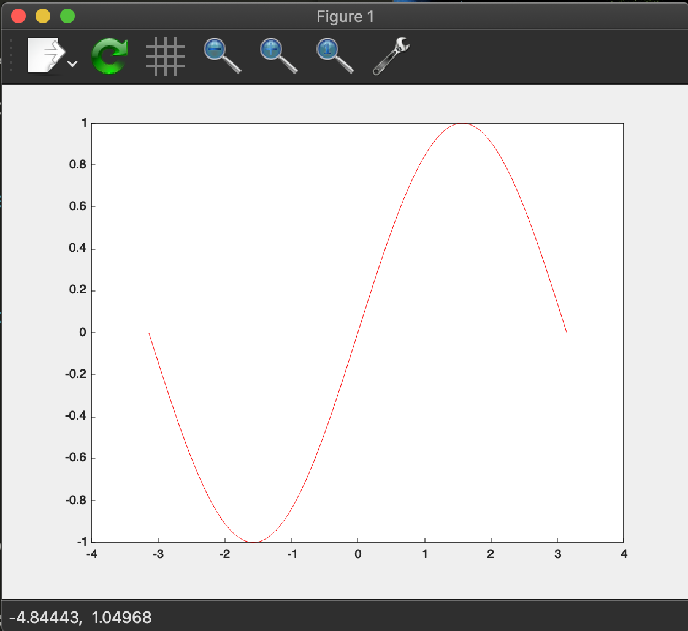

# MatplotWrap.jl

- This repository aims to [Matplot++](https://github.com/alandefreitas/matplotplusplus) for [Julialang](https://julialang.org/) users, where
  - Matplot++: A C++ Graphics Library for Data Visualization
  - Julia: A fresh approach to technical computing

- Our shared library that wraps C++ api is generated by [MatplotWrapBuilder.jl](https://github.com/terasakisatoshi/MatplotWrapBuilder.jl)
- It is tested on my macOS/Ubuntu(18.04) with Julia v1.5.2


# Prerequisite

## Prepare environment

- install `gnuplot` via e.g. `brew install ...` or `apt-get install ...` etc..
  - See [this instruction](https://github.com/alandefreitas/matplotplusplus#build-from-source) to learn more.

## Install this repository

```console
$ git clone https://github.com/terasakisatoshi/MatplotWrap.jl
$ cd MatplotWrap
$ julia --project=@. -e 'using Pkg; Pkg.instantiate(); Pkg.precompile()'
```

- Our shared library `libmplxx` is downloaded automatically using Artifact system.

# Usage

See [examples](examples) directory

### Line Plot



### Scatter Plot


# Build libmplxx.so/dylib by yourself

- Linux users should update your gcc >= 8
  - See [this instruction](https://github.com/alandefreitas/matplotplusplus#build-from-source)

- Run the following command:

```console
$ make -C ./deps
```

- Modify `libmplxx` variable inside of `src/MatplotWrap.jl`.

```julia
# Use this variable
const libmplxx = joinpath(@__DIR__, "..", "deps", "build", "lib", "libmplxx.$(dlext)")
```
